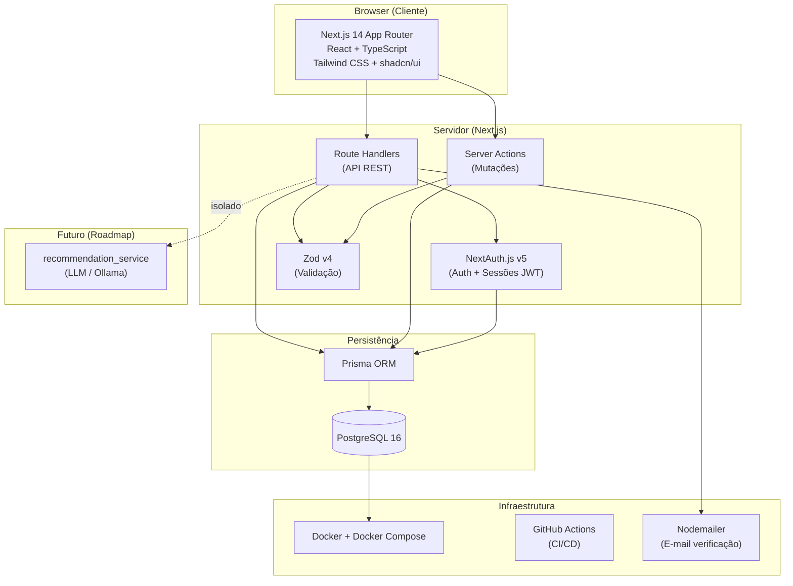

# Documento de Visão — SkoolBay

> Marketplace de Skills entre Estudantes Universitários  
> Engenharia de Software I — Instituto Piaget, 2025/2026  
> Última atualização: 11/04/2026

---

## (a) Objetivo

O SkoolBay é uma plataforma web que permite a estudantes universitários oferecer e contratar serviços entre si. O objetivo é criar um ecossistema de troca de competências dentro da comunidade académica, onde um estudante pode oferecer explicações de Cálculo, design de apresentações, tradução de textos, revisão de código, ou qualquer outro serviço com valor para os pares.

A plataforma diferencia-se de marketplaces genéricos (como Fiverr ou OLX) por ser exclusivamente académica: os perfis são verificados por e-mail institucional, os serviços são avaliados no contexto universitário, e o sistema de reputação é construído dentro da comunidade.

---

## (b) Escopo

O SkoolBay destina-se a ser utilizado em contexto de ensino superior, nomeadamente:

- Universidades e institutos politécnicos com domínios de e-mail institucional
- Qualquer instituição de ensino superior cujos estudantes possuam endereço de e-mail académico verificável

O sistema funciona exclusivamente via browser (aplicação web), sem necessidade de instalação de software adicional. Pode ser executado localmente (localhost) para fins de desenvolvimento e demonstração académica, ou em ambiente de produção via Docker.

---

## (c) Partes Interessadas (Stakeholders)

| Stakeholder | Papel | Interesse |
|-------------|-------|-----------|
| Estudantes universitários (prestadores) | Utilizadores primários — oferecem serviços | Monetizar competências e ganhar reputação académica |
| Estudantes universitários (clientes) | Utilizadores primários — contratam serviços | Encontrar apoio académico e serviços de qualidade a preços acessíveis |
| Administradores da plataforma | Gestores do sistema | Manter a qualidade, segurança e integridade da plataforma |
| Instituições de ensino superior | Stakeholders indiretos | Promover a colaboração entre estudantes e o ecossistema académico |
| Equipa de desenvolvimento | Produtores do sistema | Entregar um produto funcional e bem documentado |

---

## (d) Equipa do Projeto

| Nome | Número de Aluno | Papel |
|------|----------------|-------|
| António Rafael Marques Simões | 2022115742 | Documentação / QA |
| Diogo Filipe Gonçalves Pereira | 2024115723 | Dev Lead / Scrum Master |
| Jonathan Henriques Ferreira Alves | 2024111122 | Documentação / UX |
| Kauã Henrique Santos Pina | 2024126856 | Documentação / UML |
| Leonardo Alexandre Martins Afonso | 2022111829 | Documentação / Testes |
| Marinela Suely João Bettencourt | 2024117541 | Documentação / UX |
| Miguel Lourenço e Lozano Alves de Almeida Costa | 2024107218 | Documentação / Backlog |

---

## (e) Características do Sistema

### Funcionalidades do MVP (Must Have)

| Funcionalidade | Descrição |
|----------------|-----------|
| Autenticação | Registo e login com e-mail institucional, verificação por e-mail, sessões seguras (JWT httpOnly) |
| Perfil de utilizador | Nome, curso, universidade, foto, competências, avaliação média, histórico de serviços |
| Publicação de serviço | Título, descrição, categoria, preço, disponibilidade |
| Pesquisa e filtros | Pesquisa por texto, categoria, preço, avaliação, disponibilidade; ordenação múltipla |
| Sistema de pedidos | Pedido de serviço com mensagem, gestão de estados (pendente/aceite/concluído/cancelado/recusado) |
| Avaliações | Review após conclusão de serviço (1-5 estrelas + comentário), cálculo de rating médio |
| Dashboard | Resumo de atividade do utilizador, pedidos recebidos e enviados |
| Navegação | Layout responsivo, header com autenticação, navegação clara |

### Funcionalidades Secundárias (Should/Could Have)

- Painel do prestador com gestão completa de pedidos recebidos
- Sistema de denúncia de serviços e utilizadores inadequados
- Painel de moderação para administradores
- Landing page apelativa com serviços em destaque

---

## (f) Arquitetura de Referência

**Módulos do sistema:**

- `auth_module` — registo, login, verificação de e-mail, sessões (NextAuth.js v5)
- `user_module` — perfis, competências, histórico, avaliações recebidas
- `service_module` — CRUD de serviços, categorias, pesquisa e filtros
- `request_module` — pedidos de serviço, máquina de estados
- `review_module` — avaliações, cálculo de rating médio
- `recommendation_service` *(futuro)* — integração LLM para matching semântico

---

## (g) Restrições do Produto

| Restrição | Descrição |
|-----------|-----------|
| E-mail institucional obrigatório | O registo requer um endereço de e-mail com domínio académico válido. Sem verificação, a conta não é ativada. |
| Apenas browser | O sistema não disponibiliza aplicação nativa (iOS/Android). Funciona exclusivamente via browser. |
| Base de dados PostgreSQL | O sistema foi desenhado exclusivamente para PostgreSQL 16. Outros SGBDs não são suportados sem alterações ao schema Prisma. |
| Ambiente de execução | Requer Node.js 20+, Docker e PostgreSQL para execução local. |
| LLM não incluído no MVP | A integração com modelos de linguagem não faz parte do âmbito atual. Está isolada num módulo separado para integração futura. |
| Sem pagamentos reais | A plataforma não processa pagamentos. O preço dos serviços é informativo — a transação financeira é acordada diretamente entre estudantes. |

---

## (h) Integração LLM (Opcional — Roadmap)

O sistema foi arquitetado para permitir a integração futura de um Large Language Model, isolado num módulo independente (`recommendation_service`). O LLM nunca acede diretamente à base de dados — todas as chamadas passam pelo backend, mantendo controlo sobre dados e custos de API.

**Casos de uso planeados:**

| Funcionalidade | Descrição |
|----------------|-----------|
| Matching semântico | Em vez de pesquisa por palavras-chave, o utilizador descreve em linguagem natural o que precisa e o LLM faz correspondência semântica com os serviços disponíveis. |
| Geração de descrições | O prestador preenche um formulário simples e o LLM gera uma descrição de serviço profissional e apelativa. |
| Resumo de avaliações | Processar reviews escritas e gerar automaticamente um resumo de pontos fortes e fracos do prestador. |
| Chatbot de suporte | FAQ da plataforma respondido por LLM com RAG sobre a documentação do sistema. |
| Moderação inteligente | Deteção automática de conteúdo inadequado em anúncios e mensagens. |

**Opções de implementação futura:** Ollama (local, sem custos de API), OpenAI API, ou Anthropic API — todas compatíveis com a arquitetura isolada do `recommendation_service`.
