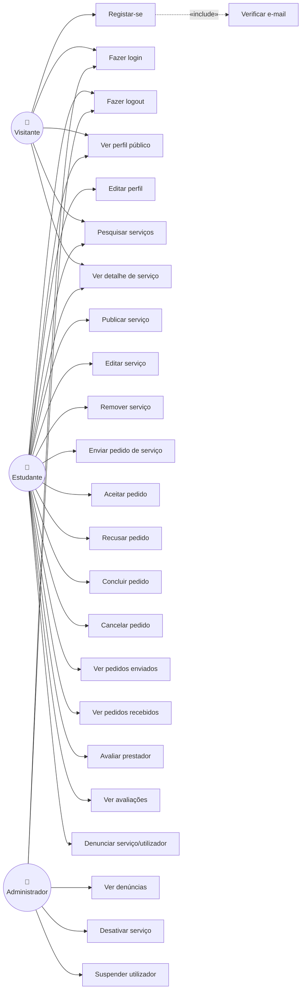

# Diagrama de Casos de Uso — SkoolBay

> Engenharia de Software I — Instituto Piaget, 2025/2026

---

## Atores

| Ator | Descrição |
|------|-----------|
| Visitante | Utilizador não autenticado — pode pesquisar e ver serviços |
| Estudante | Utilizador autenticado — pode publicar e contratar serviços |
| Prestador | Estudante que publicou pelo menos um serviço |
| Cliente | Estudante que envia pedidos de serviço |
| Administrador | Gestor da plataforma — modera conteúdo |

> Nota: Prestador e Cliente são papéis do Estudante autenticado, não atores separados. Um mesmo utilizador pode desempenhar ambos os papéis.

---

## Diagrama

---

## Descrição dos Casos de Uso Principais

### UC01 — Registar-se
**Ator:** Visitante  
**Pré-condição:** Utilizador não tem conta.  
**Fluxo principal:** Preenche formulário → sistema valida e-mail institucional → envia e-mail de verificação → conta criada inativa.  
**Inclui:** UC02 — Verificar e-mail.

### UC03 — Fazer login
**Ator:** Visitante, Administrador  
**Pré-condição:** Conta verificada e ativa.  
**Fluxo principal:** Insere credenciais → sistema autentica → redireciona para dashboard.

### UC09 — Publicar serviço
**Ator:** Estudante  
**Pré-condição:** Autenticado.  
**Fluxo principal:** Preenche título, descrição, categoria, preço → sistema valida → serviço publicado e visível.

### UC12 — Enviar pedido de serviço
**Ator:** Estudante (como Cliente)  
**Pré-condição:** Autenticado, serviço ativo, não é o dono do serviço.  
**Fluxo principal:** Clica "Pedir Serviço" → escreve mensagem → pedido criado com estado PENDING.

### UC13 — Aceitar pedido / UC14 — Recusar pedido / UC15 — Concluir pedido
**Ator:** Estudante (como Prestador)  
**Pré-condição:** Autenticado, pedido pertence ao seu serviço.  
**Fluxo principal:** Acede ao painel de pedidos → escolhe ação → estado do pedido atualizado.

### UC19 — Avaliar prestador
**Ator:** Estudante (como Cliente)  
**Pré-condição:** Pedido com estado COMPLETED, sem review anterior.  
**Fluxo principal:** Seleciona rating 1-5 estrelas → escreve comentário (opcional) → review submetida → rating médio do prestador atualizado.

### UC22 — Ver denúncias / UC23 — Desativar serviço / UC24 — Suspender utilizador
**Ator:** Administrador  
**Pré-condição:** Autenticado com role ADMIN.  
**Fluxo principal:** Acede ao painel de moderação → analisa denúncia → toma ação.
