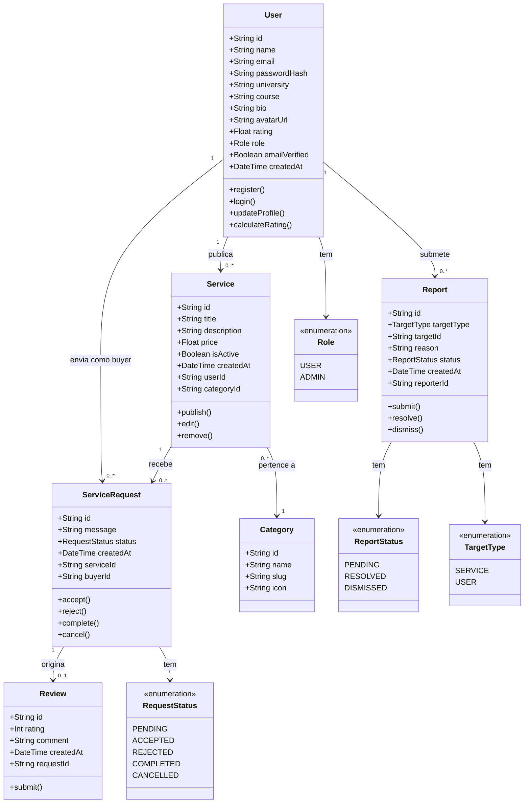
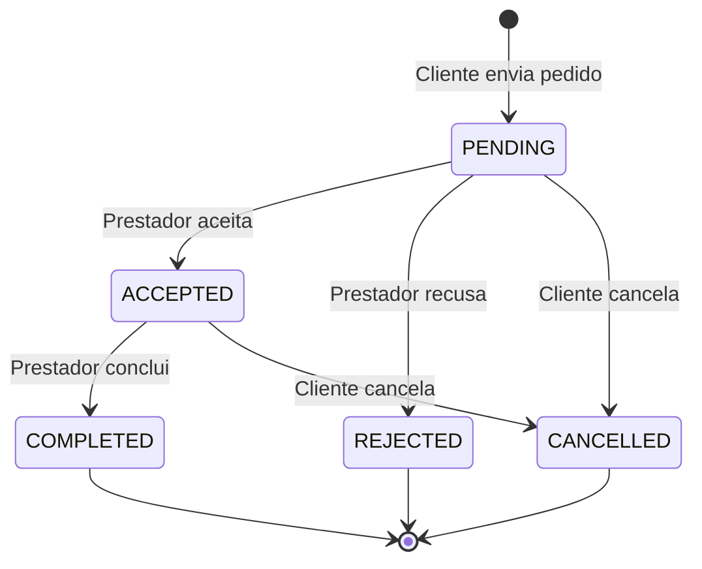

# Diagrama de Classes — SkoolBay

> Engenharia de Software I — Instituto Piaget, 2025/2026

---

## Diagrama

---

## Descrição das Entidades

### User
Representa um estudante registado na plataforma. Pode desempenhar o papel de Prestador (publica serviços) e/ou Cliente (envia pedidos). O campo `role` distingue utilizadores normais de administradores. O `rating` é calculado automaticamente com base nas reviews recebidas.

### Service
Serviço publicado por um Prestador. Tem um estado ativo/inativo (`isActive`) — a remoção é um soft delete. Pertence a uma `Category` e está associado ao `User` que o criou via `userId`.

### ServiceRequest
Pedido enviado por um Cliente para um Serviço. Segue uma máquina de estados definida pelo enum `RequestStatus`. O `buyerId` referencia o `User` que fez o pedido.

### Review
Avaliação deixada pelo Cliente após um pedido concluído. Existe no máximo uma `Review` por `ServiceRequest`. O `rating` (1-5) é usado para recalcular o `User.rating` do prestador.

### Category
Categorias pré-definidas para organizar os serviços (ex: Tecnologia, Idiomas, Design). Cada serviço pertence a uma categoria.

### Report
Denúncia submetida por um estudante contra um serviço ou utilizador. O campo `targetType` indica o alvo. Gerida pelo Administrador através do painel de moderação.

---

## Máquina de Estados — ServiceRequest

